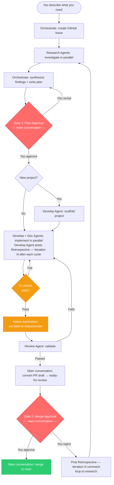
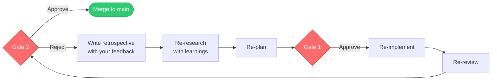
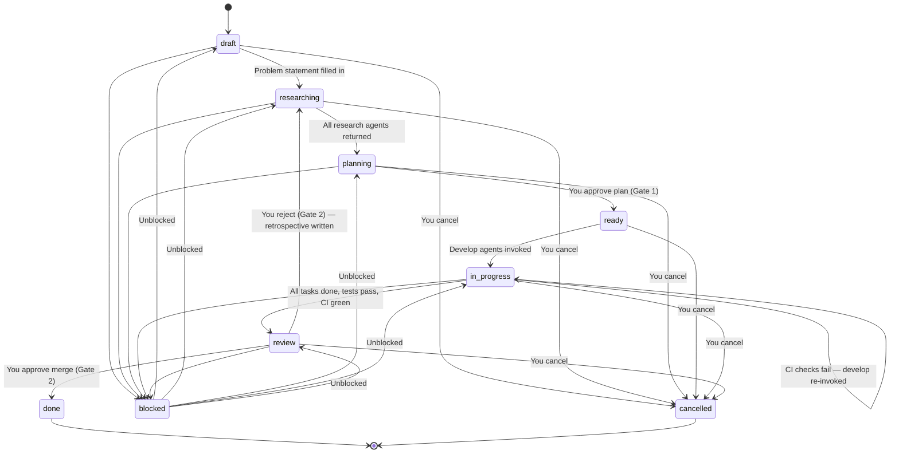
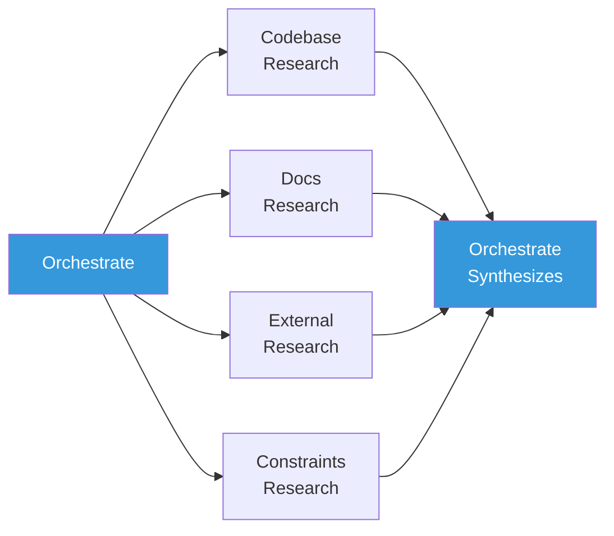
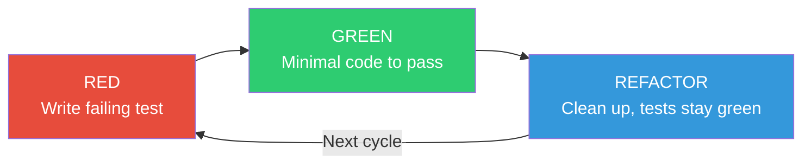

# Agent Flow — Workflow Specification

Auto is a structured software development workflow powered by specialized AI agents. Every piece of work is tracked as a GitHub Issue, developed on its own branch, implemented test-first, and documented before it reaches `main`.

The **main conversation** (you + your AI assistant) coordinates the workflow. Agents are short-lived workers for specific phases — no single agent runs the entire lifecycle. The two gates remain the control points, but how they are exercised depends on which command you run: `/auto` self-approves both and runs end-to-end, while the standalone `/issue` and `/merge` commands present the gates interactively.

## Execution Modes

**Claude Code** — slash commands drive each phase.
- `/auto` is **fully autonomous**: from any starting state it chains research → plan → implement → review → **merge** without pausing, self-approving Gate 1 and Gate 2. It is the default way to drive an issue to `main`.
- `/issue` is the interactive entry point: it creates the issue, researches, plans, and presents **Gate 1** through the Approve/Deny selection UI for a human to approve before implementation. It can also split a complex plan into **GitHub sub-issues** for parallel agent work.
- `/merge` is the interactive merge command: it validates the merge prerequisites and presents **Gate 2** through the selection UI, then merges and verifies the merge landed.

Run `/issue` then `/merge` when you want a human at each gate; run `/auto` when you want the whole thing driven autonomously.

**Copilot chat-orchestrated** — the main conversation drives each phase via `@orchestrate` in VS Code.

**GitHub-native** — issue labels, assignees, and PR events drive phase transitions directly on GitHub.

### GitHub-Native Event Triggers

| Trigger | Result |
|---------|--------|
| Issue created with `status/draft` | Issue agent runs intake, research, and planning |
| Plan approved | Issue moves to `status/ready` |
| Copilot assigned to `status/ready` issue | Branch `issue/{number}` created, label → `status/in-progress`, TDD starts |
| PR opened from `issue/{number}` | Issue stays `status/in-progress` |
| CI checks green on draft PR | Label → `status/review`, Review Agent invoked |
| Review Agent returns PASS | PR converted from draft to ready-for-review |
| CI checks fail on PR | Develop Agent re-invoked with failure output and prior retrospective |
| PR merged | Issue → `status/done` and closed |

## Workflow Diagram



## Phase Coordination

| Phase | Who runs it | What happens |
|-------|------------|--------------|
| 1. Init | Orchestrate | Creates GitHub Issue, checks for duplicates |
| 2. Research | Research Agents (parallel) | Investigate codebase, docs, external sources, constraints |
| 3. Synthesize + Plan | Orchestrate / `/issue` | Merges research, writes plan, optionally splits into sub-issues, presents Gate 1 |
| 4. Gate 1 | `/issue` (interactive) or `/auto` (self-approved) | Approve/revise the plan; `/auto` auto-approves |
| 5. Implement | Develop + Documentation Agents (parallel) | Creates feature branch, Red-Green-Refactor, docs updated |
| 6. Review | Review Agent | Validates TDD compliance, quality, tests |
| 7. Gate 2 | `/merge` (interactive) or `/auto` (self-approved) | Approve/deny the merge; `/auto` auto-approves once prerequisites hold |
| 8. Merge | `/merge` or `/auto` | Merges branch, **verifies the merge landed**, closes issue |

**Parallel rules:**
- Research angles (codebase, docs, external, constraints) run in parallel.
- Develop Agent(s) + Documentation Agent run in parallel during implementation.
- Review is always sequential — implementation must be complete first.
- **Sub-issues run in parallel:** when `/issue` splits a plan into file-disjoint sub-issues, `/auto` on the parent fans out one `/auto` sub-agent per child (each in its own worktree).

**Multi-issue orchestration:** When the user grants broad autonomy across several issues at once, one `/auto` sub-agent is spawned per issue (each in its own worktree). Concurrency, post-merge verification, friction handling, and delegated gate authority are governed by the "Managing Autonomous Sub-agent Teams" section in `CLAUDE.md`.

## Approval Gates

Gates are decision points, not always human pauses. **`/auto` self-approves both** and runs straight through — autonomy removes the human *pause*, never the *quality bar* (a gate's preconditions must still hold). The standalone **`/issue`** and **`/merge`** commands present the same gates interactively, in Claude Code via the **Approve/Deny/Other selection UI** (Copilot agents keep a plain-text prompt).

### Gate 1 — Plan Approval

**When:** After research is complete and a plan has been drafted.

**You see:** Synthesized research findings, open questions, the proposed plan, acceptance criteria, and any proposed sub-issue decomposition.

**Your options (interactive `/issue` only):**
- **Approve** — set `status/ready`, create sub-issues if proposed, implementation can begin
- **Revise** — request changes, answer open questions, adjust scope or the decomposition

**Under `/auto`:** auto-approved once a plan and acceptance criteria exist.

### Gate 2 — Merge Approval

**When:** After implementation is complete, tests pass, and the Review Agent has signed off.

**Prerequisites — all four required (enforced even under `/auto`):**
1. Issue has `status/review` label
2. Review Agent returned PASS
3. CI checks are green on the PR
4. The PR is mergeable (no conflicts with `main`)

Only after all four are satisfied is the PR converted from draft to ready-for-review and Gate 2 presented (or, under `/auto`, the merge performed).

**You see:** Review Agent summary, retrospective, diff summary, proposed merge commit message.

**Your options (interactive `/merge` only):**
- **Approve** — branch merges to `main`, the merge is verified, issue closes with `status/done`
- **Deny** (or Other + feedback) — a `## Retrospective — Iteration N` comment is posted, label resets to `status/researching`, workflow loops back to research

**Under `/auto`:** auto-approved once all four prerequisites hold; `/auto` then merges and verifies success without pausing.



## Issue Lifecycle

### Status Labels

| Label | What's happening |
|-------|-----------------|
| `status/draft` | Issue created, problem described |
| `status/researching` | Research Agents investigating |
| `status/planning` | Research done, plan being written |
| `status/ready` | Plan approved, ready for implementation |
| `status/in-progress` | Code being written via TDD |
| `status/review` | Implementation done, being validated |
| `status/done` | Merged to `main`, issue closed |
| `status/blocked` | Waiting on external input or your decision |
| `status/cancelled` | Abandoned by your decision |

Issues also carry a type label: `bug`, `feature`, `refactor`, `docs`, `test`, `chore`.

### State Machine



### Issue Structure

Issues use a structured body template (enforced via `.github/ISSUE_TEMPLATE/workflow-issue.yml`):

```markdown
## Problem Statement
## Description
## Research
### Key Findings
### Constraints
### Open Questions
## Plan
## Acceptance Criteria
```

Branches follow the naming convention `issue/{issue-number}` (e.g. `issue/42`).

## Agents

### Claude Code Slash Commands

| Command | Purpose | Equivalent Copilot agent |
|---------|---------|--------------------------|
| `/issue` | Create issue, parallel research, plan, optional sub-issue split, Gate 1 (selection UI) | `@orchestrate` / `@issue` |
| `/auto` | Auto-drive full workflow from current state to merge; fully autonomous (self-approves both gates) | *(new — no Copilot equivalent)* |
| `/merge` | Validate prerequisites, present Gate 2 (selection UI), merge, verify success | `@merge` |
| `/develop` | One Red-Green-Refactor cycle with retrospective | `@develop` |
| `/document` | Maintain `docs/` | `@documentation` |
| `/review` | Pre-merge validation | `@review` |
| `/research` | Single-strategy investigation | `@research` |

**Config:** `.claude/commands/` | Requires Claude Code

The `/auto` command is unique to Claude Code: it reads the current `status/*` label on a given issue and drives all appropriate phases automatically — spawning research, develop, document, and review sub-agents as needed, then merging — **fully autonomously, without pausing at either gate**. When the issue is a parent with sub-issues, it fans out one `/auto` sub-agent per child. Human-in-the-loop gate review is available through the standalone `/issue` (Gate 1) and `/merge` (Gate 2) commands, which use the Approve/Deny selection UI. `gh` CLI is available in Claude Code (unlike Copilot cloud), so commands use it directly without MCP configuration.

---

### Issue Agent

Handles GitHub-native intake and planning when work starts from an issue.

- Validates issue structure, runs duplicate checks, runs parallel research, synthesizes into plan + acceptance criteria, prepares Gate 1 material.
- Does **not** implement, run Gate 2, or merge.

**Config:** `.github/agents/issue.agent.md` | Model: Claude Opus 4

### Orchestrate Agent

Entry point for VS Code chat-driven mode. Handles Phases 1–3.

- Checks for duplicate issues, creates GitHub Issue, selects and invokes Research Agents, synthesizes findings, writes the plan, presents Gate 1.
- Does **not** implement, review, run Gate 2, or merge.

**Config:** `.github/agents/orchestrate.agent.md`

### Research Agent

Investigates one angle per invocation. Invoked 2–4 in parallel. Read-only (~10 tool calls per invocation).



| Strategy | Investigates | Sources |
|----------|-------------|---------|
| **Codebase** | Existing patterns, data flows, test gaps | Source files, tests |
| **Docs** | Documented decisions, past issues | `docs/`, ADRs, GitHub Issues |
| **External** | Industry patterns, candidate libraries | Web search, library docs |
| **Constraints** | Security, performance, compatibility | OWASP, API contracts |

**Config:** `.github/agents/research.agent.md` | Model: Claude Sonnet 4 | Cannot modify files.

### Develop Agent

Implements one component via strict Red-Green-Refactor (~15–20 tool calls per invocation). For multiple components, invoke multiple Develop Agents.



1. **RED** — Write a failing test. Commit: `test: ... [RED]`
2. **GREEN** — Minimal code to pass. Commit: `feat: ... [GREEN]`
3. **REFACTOR** — Clean up; tests stay green. Commit: `refactor: ... [REFACTOR]`

After each cycle, the agent posts a `## Retrospective — Iteration N` comment to the issue (and PR if one exists). For new projects with no build tool, scaffold first with `chore(scaffold): ...` before beginning RED-GREEN-REFACTOR.

**Config:** `.github/agents/develop.agent.md`

### Documentation Agent

Maintains all documentation in `docs/`. Invoked in parallel with Develop Agents (~10–15 tool calls).

- Updates `docs/api/` for API changes, creates ADRs in `docs/decisions/` for significant choices, updates `README.md` for new setup steps.
- Enforces the no-docs-outside-`docs/` rule.

**Config:** `.github/agents/documentation.agent.md` | Model: Claude Sonnet 4

### Review Agent

Pre-merge quality gate. Read-only (~15–20 tool calls). Invoked only after CI is green on the draft PR.

**Checks:** Conventional Commits format, TDD sequence (RED before GREEN in git log), code quality, test quality, docs updated, full test suite passes.

**Output:** PASS (ready for Gate 2) or FAIL (specific issues listed).

**Config:** `.github/agents/review.agent.md` | Model: Claude Opus 4 | Cannot modify files.

### Merge Agent

Takes a reviewed, CI-green PR through Gate 2 and merges it to `main`, then verifies the merge actually landed.

**Prerequisites (hard gate):** `status/review`, Review PASS, CI green, mergeable PR.

**Interactive (`/merge`):** presents Gate 2 via the Approve/Deny selection UI. On Approve → merge + verify; on Deny/feedback → post retrospective and reset to `status/researching`.

**Autonomous (invoked by `/auto`):** self-approves and merges without prompting.

**Verification:** confirms PR `state == MERGED`, the issue is closed at `status/done`, and `main` advanced — never assumes success from the merge call alone.

**Config:** `.claude/commands/merge.md` (Claude Code), `.github/agents/merge.agent.md` (Copilot)

## Configuration

### `workflow.conf`

All git hooks source this file. Auto-detected on first use; edit manually only if needed.

```bash
TEST_CMD="npm test"        # Your test command (pytest, go test ./..., cargo test, etc.)
SRC_DIRS="src/ lib/"       # Where implementation code lives
TEST_DIRS="tests/ test/"   # Where test files live
MAIN_BRANCH="main"
```

### `.github/hooks/doc-freshness.json`

A Copilot PostToolUse hook. After file edits, reminds the agent to check whether `docs/` needs updating. Advisory only.

### `.github/workflows/`

- **`pr-checks.yml`** (display name **PR Checks**) — Runs three parallel jobs on every PR: `test` (full test suite from `workflow.conf`), `check-commits` (Conventional Commits validation), and `policy` (workflow policy checks). Replaces the former `test-suite.yml`, `conventional-commits.yml`, and `workflow-policy.yml`, which were merged to reduce CI run fan-out. Job ids are preserved so existing branch-protection required checks keep matching.
- **`ci-issue-gate.yml`** — Triggers on `workflow_run` completion of **PR Checks**; advances the issue past the CI gate. Fires once per PR push (previously once per separate workflow).
- **`issue-state-guard.yml`** — Self-heals issue status labels. Has a `concurrency` group keyed on the issue number with `cancel-in-progress: true`, so an unlabel+label transition pair collapses to one effective run.
- **`issue-native-automation.yml`** — Handles GitHub-native issue automation, including `/auto ` slash-command comments.
- **`pr-issue-sync.yml`** — Keeps PR and linked issue state in sync.
- **`repo-setup.yml`** — One-time repository bootstrap (labels, settings).
- **`labels-sync.yml`** — Syncs the canonical label set to the repo.
- **`copilot-setup-steps.yml`** — Setup steps for the GitHub Copilot coding agent.

#### CI fan-out / cost notes

- **Merged PR Checks workflow.** Collapsing the three former per-PR workflows into one workflow with three parallel jobs reduces the number of GitHub Actions runs (and the `workflow_run` events that `ci-issue-gate.yml` reacts to) without losing any individual check.
- **Status-guard concurrency.** A status transition removes one label and adds another, firing two `issue-state-guard.yml` runs in quick succession. The `concurrency` group (keyed on issue number, `cancel-in-progress: true`) collapses these to a single effective run. A manual sole-label removal still triggers an `unlabeled` run, so the guard continues to self-heal a stripped issue back to `status/draft`.
- **Comment-job prefix guard.** The `comment-commands` job in `issue-native-automation.yml` runs only when the comment body starts with `/auto `, so ordinary comments (develop retrospectives, bot status updates) skip the job and consume no compute.
- **Branch-protection caveat.** Required status checks are configured manually because the workflow token lacks the scope to set them. The merged workflow preserves the job ids `test`, `check-commits`, and `policy`, so branch protection that references those job names keeps working unchanged. Anyone whose branch protection referenced the old *workflow* names ("Test Suite", "Conventional Commits Check", "Workflow Policy") rather than the job ids must update their required checks to the **PR Checks** workflow / those job names.

## Git Hooks

Activated by: `bin/setup-hooks` (runs `git config core.hooksPath .githooks` idempotently).

Run it once per clone **and once in every new worktree**. The path is set
*relative* (`.githooks`) on purpose: `git worktree` checkouts share the main
repo's `.git/config`, and Git resolves a relative `core.hooksPath` against each
working tree's own root, so the single shared value fires hooks correctly in the
main checkout and every worktree. An absolute value would point all worktrees at
one fixed directory and silently bypass the hooks elsewhere. `git worktree add`
does not run the activation for you.

Uses a **dispatcher pattern** — each hook type runs all scripts in its `.d/` subdirectory, keeping rules modular.

### Pre-Commit

| Hook | Enforces |
|------|----------|
| Branch Guard | Blocks direct commits to `main` |
| Doc Placement Guard | Blocks new `.md` files outside `docs/` (except `README.md` and `.github/`) |
| TDD Cycle Guard | On issue branches, blocks source-only commits if no test commits exist yet |

### Commit-Msg

| Hook | Enforces |
|------|----------|
| Conventional Commits | Rejects messages not matching `type(scope): description` |
| Issue Linkage | Auto-appends `Closes #{number}` to commits on `issue/*` branches |

### Pre-Push

| Hook | Enforces |
|------|----------|
| Issue Status Consistency | Verifies the GitHub Issue exists and has at least `status/in-progress` |
| Test Suite Gate | Runs the full test suite; broken code never leaves the local branch |

### Post-Commit

| Hook | Does |
|------|------|
| Doc Freshness Check | Prints a reminder to update `docs/` when source files change. Advisory only. |

## Conventional Commits

```
type(scope): description

[optional body]

Closes #42
```

| Type | When to use | TDD Phase |
|------|-------------|----------|
| `test` | Adding or updating tests | RED |
| `feat` | New feature implementation | GREEN |
| `fix` | Bug fix | GREEN |
| `refactor` | Restructuring, no behavior change | REFACTOR |
| `docs` | Documentation changes | — |
| `chore` | Build, CI, tooling changes | — |
